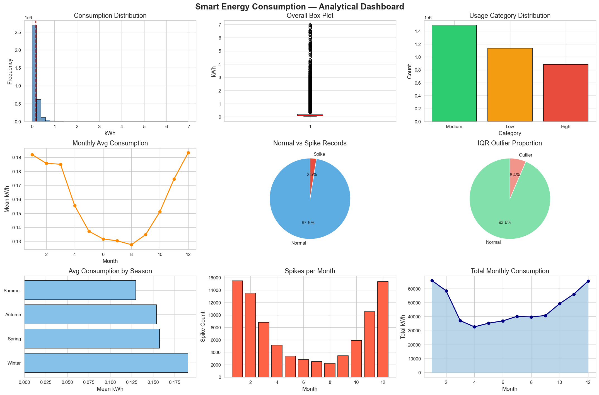

# Smart Energy Consumption Analysis

Smart Meter Data Analytics • EDA • Hypothesis Testing • Anomaly Detection

## View Project

🔗 **Live Interactive Report:** [Open Here](https://krishna771.github.io/smart-energy-consumption-analysis/smart_energy_consumption_analysis.html)

📓 **Jupyter Notebook**
smart_energy_consumption_analysis.ipynb

> The live report contains the complete notebook including code, visualizations, statistical analysis, and outputs. If GitHub cannot render the notebook preview correctly, open the interactive report above.




## Overview
This project analyzes smart meter energy consumption data using data analytics and statistical techniques to identify trends, anomalies, and usage patterns.

## Key Results
- Analyzed over 3.5 million smart meter records.
- Detected anomalous consumption patterns using IQR and Z-score methods.
- Performed Chi-Square and T-Test statistical analysis.
- Identified seasonal and monthly energy usage trends.
- Generated energy-saving recommendations based on consumption behavior.

## Features
- Data Cleaning and Preprocessing
- Exploratory Data Analysis (EDA)
- IQR-Based Outlier Detection
- Z-Score Analysis
- Chi-Square Hypothesis Testing
- T-Test Analysis
- Monthly and Seasonal Trend Analysis
- Personalized Energy Consumption Assessment
- Energy Saving Recommendations

## Technologies Used
- Python
- Pandas
- NumPy
- Matplotlib
- Seaborn
- SciPy
- Jupyter Notebook

## Project Structure

```text
data/
images/
smart_energy_consumption_analysis.ipynb
requirements.txt
README.md
```

## Installation

```bash
pip install -r requirements.txt
```

## Run

Open the notebook and execute all cells:

```bash
jupyter notebook
```

## Dataset

The dataset contains over 3.5 million smart meter energy consumption records used for statistical analysis and visualization.
